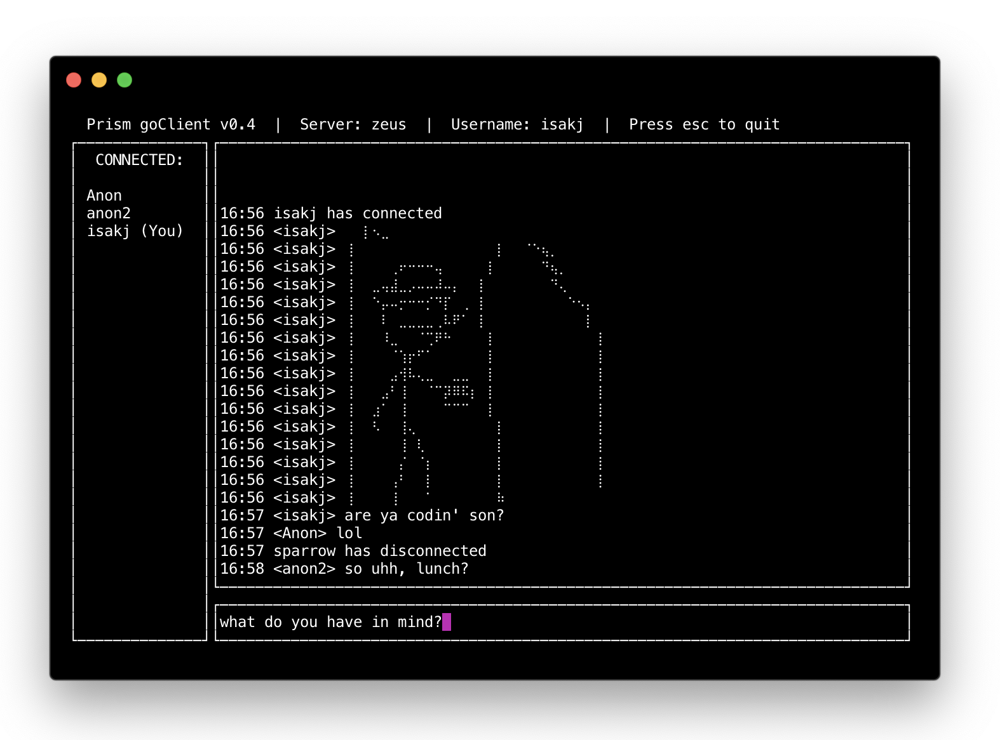

# Prism

An End to End encrypted chat room written in go with a custom communication protol (Prism Protocol) that allows for cross platform client development.

## Getting Started

Simply download the binary relevant to your operating system and run it!
Enter the server IP address and a username of your choice. You'll also need a 32-Byte key that other people in the server have in order to see their messages. Only clients with the same 32-Byte key can decrypt each other's messages.

Alongside a client you'll of course need a server to connect to. Be sure to grab a server binary as well if you need one. Do note that the Prism server runs on tcp port 14296.

## Downloads

#### Client

[Windows 10 64-bit](https://github.com/joshua-isak/Prism/blob/master/prism-client/prism-client.exe)

[Linux 64-bit](https://github.com/joshua-isak/Prism/blob/master/prism-client/prism-client)

[OSX 64-bit](https://github.com/joshua-isak/Prism/blob/master/prism-client/prism-osx-client)

#### Server

[Linux 64-bit](https://github.com/joshua-isak/Prism/blob/master/prism-server/prism-server)

## Prism Protocol

Prism Protocol (PP) is a low level application layer protocol built on top of TCP that governs communication between Prism servers and clients.

PP uses the concept of "packet types" to divide communications into discrete functions. The currently implemented "packet types" are as follows:

- Initial
- Welcome
- ServerDisconnect
- ClientConnect
- ClientDisconnect
- GeneralMessage

**Before the packet type byte, there are two bytes that form a uint16 which designate the size of the data to be read from the tcp buffer. This suffix exists before each communication between the client and server. A good implementation will read these two bytes (unsigned x) from the tcp buffer, then read in x bytes and handle the "packet" from there.**

**Also note that PP uses network byte order**

### Initial [1]

After establishing a TCP connection to the server, the first thing a client sends to the server is an "Initial" type packet. This packet contains the packet type (1 for the Initial type), the length of the client's username, the client's username, as well as the client's version. If the client doesn't send this packet within 20 seconds the TCP connection is closed.

Once the Initial packet is sent the server will make sure the client's version is compatible, and that the data sent makes sense. If either of those cases are not true then the client will be disconnected.

| Byte # | Details |
| ------ | ------- |
| 0 | The packet type 1 (0x1) |
| 1 | The length of the username (uint8) |
| 2 to 22 | The username encoded in UTF-8 |
| 23 to 30 | Client version information encoded in UTF-8 |

### Welcome [2]

After sending the Initial packet the client will wait for the server to respond with the Welcome packet. The Welcome packet contains information needed to get the client up to speed with dynamic information. Currently this information is simply the number of users connected to the server as well as their usernames. A maximum of 255 clients can be connected to a single server.

NOTE: Bytes 1 and onward can be empty if there are no users connected to the server

| Byte # | Details |
| ------ | ------- |
| 0 | The packet type 2 (0x2) |
| 1 | Number of currently connected clients (uint8) |
| 2 | The length x of a username (uint8) |
| 3 to x | The username encoded in UTF-8 |
| x + 1 | The length y of a username |
|x + 2 to y | The username encoded in UTF-8 |
| . . . | And so on... |

### ServerDisconnect [3]

For whatever reason the server may notify that client that it has been disconnected from the server for a non tranport layer reason, such as the server chatroom being full, or the client's username already being in use. This packet will arrive right before the tcp connection is closed, and contains an error code, as well as a reason for the disconnect as a UTF-8 string.

| Byte # | Details |
| ------ | ------- |
| 0 | The packet type 3 (0x3) |
| 1 | Disconnect reason code (uint8) |
| 2 | The length x of a plaintext disconnect reason (uint8) |
| 3 to x | The disconnect reason encoded in UTF-8 |

### ClientConnect [5]

When a new client connects to the server, the server sends a ClientConnect packet to inform each connected client that a new client has connected. This packet type contains the length of the client's username, and the username itself.

| Byte # | Details |
| ------ | ------- |
| 0 | The packet type 3 (0x5) |
| 1 | The length of the username (uint8) |
| 2 to 22 | The username encoded in UTF-8 |

### ClientDisconnect [6]

When a client disconnects from the server, the server sends a ClientDisconnect packet to inform each connected client that a client has disconnected. Packet structure is the same as ClientConnect, albeit with a different value for the first byte.

| Byte # | Details |
| ------ | ------- |
| 0 | The packet type 4 (0x6) |
| 1 | The length of the username (uint8) |
| 2 to 22| The username encoded in UTF-8 |

### GeneralMessage [20]

Once the Welcome packet is received by the client, it can begin sending messages to the server that will be sent to all clients in the room using the GeneralMessage packet type. The server will also send this same packet type back to the client to inform it of messages sent from other users connected to the server.

NOTE: Every client that sends a GeneralMessage receives a reply from the server in the form of a GeneralMessage that is exactly the same as the one it sent out.

NOTE II: Unencryted messages are encoded in UTF-8, but the client should never send an unencrypted message.

NOTE III: Messages are encrypted using 256-bit AES

| Byte # | Details |
| ------ | ------- |
| 0 | The packet type 20 (0x14) |
| 1 | The length of the username (uint8) |
| 2 to 22 | The username encoded in UTF-8 |
| 23 | A boolean, true if the message is encrypted |
| 24 | The length x of the message |
| 25 - x | The message